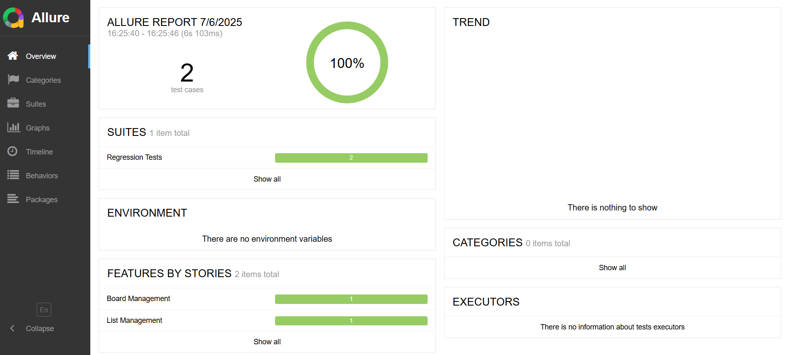
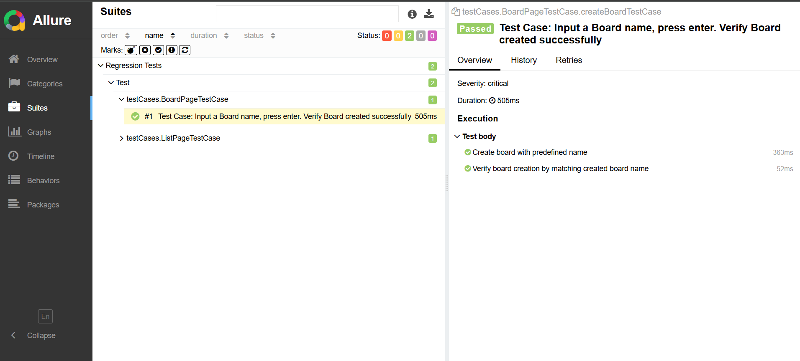
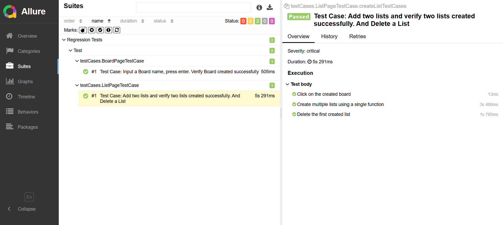

# Transmediainc Selenium Test Automation 

This repository contains an automated UI test suite for **Transmediainc**, built using:

- Java + Selenium WebDriver
- TestNG as a test framework
- Maven for build and dependency management
- Allure for test reporting

---

## 📁 Folder Structure

    
 

    Transmediainc-Automation/  
    ├── pom.xml # Maven configuration and dependencies  
    ├── testngSuite.xml # TestNG suite XML configuration  
    ├── src/  
    │ ├── main/    
    │ └── test/  
    │ │ └── java/
    │ │ │  └── configuration/
    │ │ │  │  └── BasePage.java
    │ │ │  │  └── BaseTest.java 
    │ │ │  └── pages/
    │ │ │  │  └── BoardPage.java
    │ │ │  │  └── ListPage.java 
    │ │ │  └── testCases/
    │ │ │  │  └── BoardPageTestCase.java
    │ │ │  │  └── ListPageTestCase.java 
    │ │ │  └── utilities/
    │ │ │  │  └── Variables.java 

## ✅ Features

- Page Object Model (POM) design pattern
- TestNG for test configuration and execution
- Browser-based automation using Selenium
- Configuration via  TestNG XML
- Allure HTML reports with test evidence

## 🧪 Test Scenarios

The automation test suite includes:

1.  **Input a Board name, press Enter. Verify Board was created successfully.**  

    -   Create a board with a predefined name
    -   Verify board creation by matching the created board name
3.  **Add two lists and verify that two lists were created successfully.** 
    -   Click on the newly created board
    -   Create multiple lists using a single function
4.  **Delete a list** 
    -   Delete the first created list
    
   ## ▶️  How to Run the Tests

### ✅ Prerequisites

- Java 17+ installed
- Maven installed
- Allure installed
- ChromeDriver is available in the system path or configured in code

### 🔧 Clone and Build

    git clone git@github.com:jamilsadiq/Transmediainc-Automation.git 
    cd Transmediainc-Automation
    
### 🚀 Run locally 

    mvn clean install
    mvn clean test
### 📝 Generate Allure Report 

    allure generate allure-results --clean -o allure-report
### 🔎 Open Allure Report

    allure open allure-report

 # 📊 Sample Report Output

The HTML report contains:
-   Execution summary
-   Test case results
-   Response details and assertions
-   Failure trace 
You can open the report in any browser.
